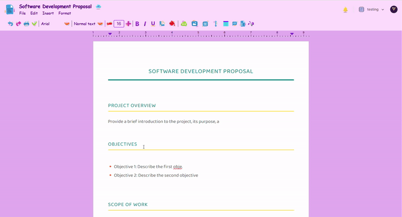

# DocSync

DocSync is a powerful real-time collaborative document editor built with **Next.js 15**, **Shadcn UI**, and **Tailwind CSS**. Designed for modern remote and hybrid work environments, DocSync brings together advanced editing capabilities, seamless collaboration, and rich formatting tools—all in one intuitive platform. Built to empower teams with efficient, real-time document collaboration, DocSync invites you to explore the code and experiment with the features.

---

## Key Features

- **📝 Rich Text Editor:**  
  Enjoy a fully featured editor with robust text formatting, lists, checklists, and more.

- **🤝 Real-time Collaboration:**  
  Multiple users can edit documents simultaneously with live updates powered by a real-time database.

- **💭 Comments & Mentions:**  
  Enhance team collaboration with in-line comments and user mentions.

- **🔔 Notifications System:**  
  Stay informed with real-time notifications for document updates and collaboration events.

- **📑 Document Templates:**  
  Kickstart your work with a gallery of pre-designed templates.

- **📋 Copy and Paste Formatting:**  
  Preserve formatting across documents seamlessly.

- **↩️ Undo/Redo History:**  
  Effortlessly navigate through changes with comprehensive history support.

- **📊 Table Support:**  
  Easily insert and edit tables within your documents.

- **🖼️ Image Uploads:**  
  Embed images directly into your content.

- **📏 Margin Controls & Collaborative Margin Ruler:**  
  Fine-tune layout with precise margin adjustments.

- **⬇️ Export Options:**  
  Export your documents to PDF, HTML, TXT, or JSON.

- **👥 User Profiles & 🏢 Organization Workspaces:**  
  Manage your team with personalized profiles and dedicated workspaces.

- **✉️ Organization Invites:**  
  Seamlessly invite team members to collaborate.

- **🔒 Secure Authentication:**  
  Robust user authentication to protect your documents.

- **📱 Responsive Design:**  
  Fully optimized for desktop and mobile experiences.

- **🎯 Cursor Tracking:**  
  Visualize collaborators’ cursors in real time.

- **🎨 Comprehensive Formatting Tools:**  
  From font families and headings to color tools and custom extensions like font size and line height.

- **🔗 Link Embedding:**  
  Easily insert and manage links within your text.

## User Login & Registration Page


## Dashboard & Home Overview


## Real-Time Collaborative Editing


## In-Line Discussion Threads


## Alerts & Notifications Center


## Seamless Document Renaming: Tap the document title to rename instantly for a seamless workflow.



## Technologies Used

### Frontend
- Next.js 15
- React.js 19
- Tailwind CSS
- Radix UI
- Tiptap
- Recharts
- Sonner

### Authentication
- Clerk

### State Management
- Zustand

### Backend
- Convex
- Liveblocks
  
## Installation Steps

1. **Clone the Repository:**
    ```bash
    git clone <your-repo-url>
    cd <your-repo-directory>
    ```

2. **Install Project Dependencies:**
    ```bash
    npm install
    ```
   
3. **Configure Environment Variables:**
    - Create a `.env` file in the root directory.
    - Add the following environment variables:
        ```dotenv
       NEXT_PUBLIC_CLERK_FRONTEND_API=your-clerk-frontend-api
       NEXT_PUBLIC_CLERK_API_KEY=your-clerk-api-key
       CONVEX_API_URL=your-convex-api-url
       LIVEBLOCKS_PUBLIC_KEY=your-liveblocks-public-key
        ```

4. **Start Prisma Service:**
   - Ensure Prisma is set up and running. First, run the following command to generate Prisma Client and apply migrations:
   ```bash
   npx prisma generate
   npx prisma migrate dev
   ```
   - You can then start the Prisma Studio to interact with your database:
   ```bash
   npx prisma studio
   ```

5. **Set Up Backend (Convex)**
   - Run the backend locally using Convex. In a new terminal window, navigate to the project directory and run:
   ```bash
    npx convex dev
    ```

6. **Run Your Project:**
    ```bash
    npm start
    ```
    
8. **Check if the Application is Running:**
    - Open your browser and navigate to `http://localhost:3000`.


If you'd like to review the source code in detail, please feel free to reach out to me directly. While the repository is currently private, I'm more than happy to arrange access upon request. You can also try the live demo at [this link](https://doc-sync-red.vercel.app/). Thank you for your understanding and interest in exploring DocSync further!  
